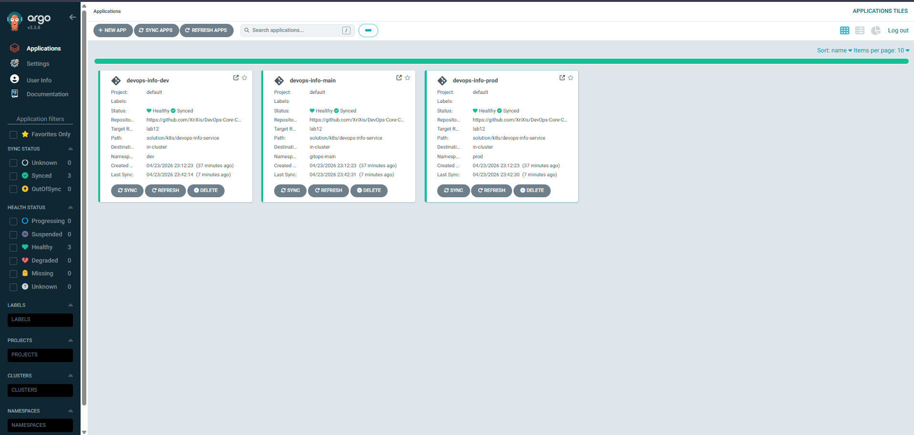
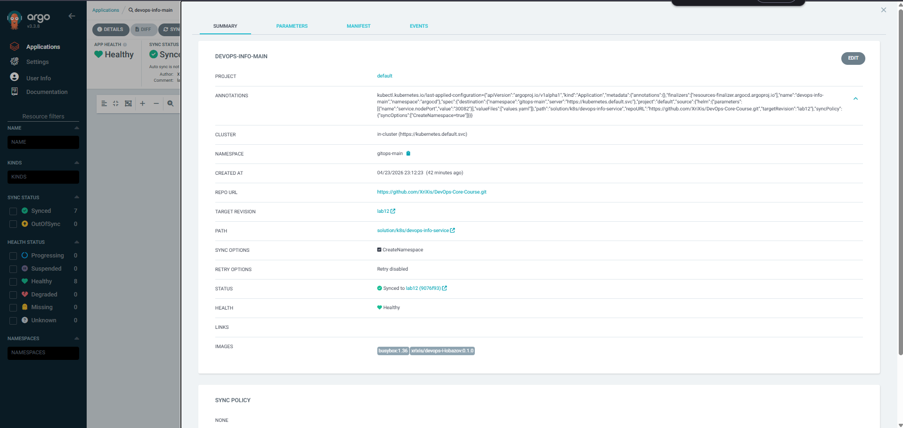
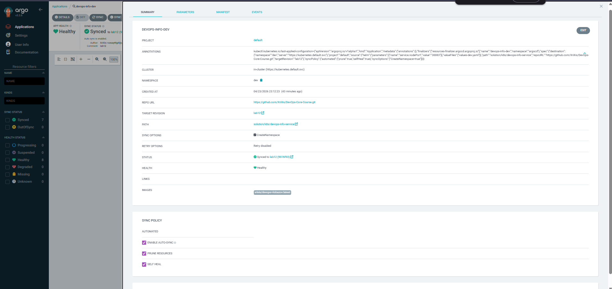
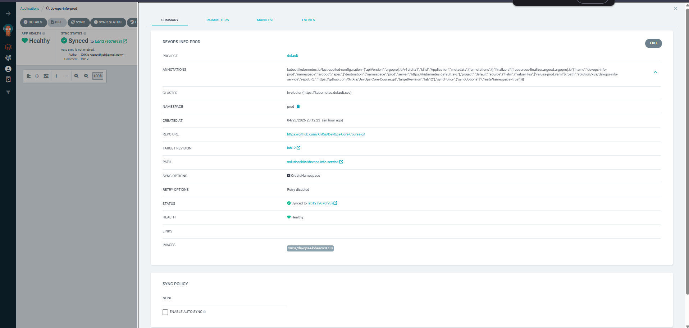
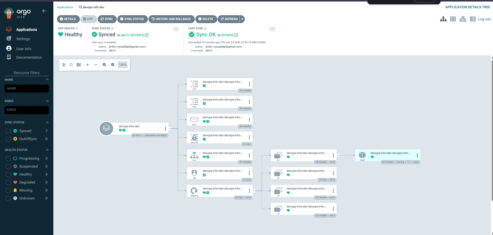

# LAB13 - GitOps With ArgoCD

## 1. Overview

This lab implements GitOps-style continuous deployment for the existing Helm chart with ArgoCD. The deployment source is the Helm-based application from Labs 10-12, tracked from the repository branch `lab12`.

Prepared project artifacts:

- [`k8s/argocd/application.yaml`](c:/Users/xzsay/PycharmProjects/DevOps-Core-Course/k8s/argocd/application.yaml) for the initial manual-sync application
- [`k8s/argocd/application-dev.yaml`](c:/Users/xzsay/PycharmProjects/DevOps-Core-Course/k8s/argocd/application-dev.yaml) for the `dev` environment with automatic sync and self-healing
- [`k8s/argocd/application-prod.yaml`](c:/Users/xzsay/PycharmProjects/DevOps-Core-Course/k8s/argocd/application-prod.yaml) for the `prod` environment with manual sync
- this report in [`k8s/ARGOCD.md`](c:/Users/xzsay/PycharmProjects/DevOps-Core-Course/k8s/ARGOCD.md)

Validated live environments:

- `gitops-main` for the initial manual-sync application
- `dev` for automated sync and self-healing
- `prod` for manual production-style promotion

Compared to the previous `lab11` revision, the `lab12` chart renders additional runtime resources:

- environment `ConfigMap`
- application `ConfigMap`
- `PersistentVolumeClaim`

These resources were also successfully reconciled by ArgoCD during the final sync.

## 2. ArgoCD Installation And Access

### 2.1 Helm installation

Commands used:

```powershell
.\helm.exe repo add argo https://argoproj.github.io/argo-helm
.\helm.exe repo update
.\kubectl.exe create namespace argocd --dry-run=client -o yaml | .\kubectl.exe apply -f -
.\helm.exe install argocd argo/argo-cd --namespace argocd --version 9.5.4 --wait --timeout 10m
```

Observed install result:

```text
NAME: argocd
NAMESPACE: argocd
STATUS: deployed
REVISION: 1
DESCRIPTION: Install complete
```

### 2.2 Component readiness

Command:

```powershell
.\kubectl.exe get pods -n argocd
```

Observed state:

```text
NAME                                                READY   STATUS    RESTARTS   AGE
argocd-application-controller-0                     1/1     Running   0          26m
argocd-applicationset-controller-559566846f-w2vqj   1/1     Running   0          26m
argocd-dex-server-8f5687997-wwcv7                   1/1     Running   0          26m
argocd-notifications-controller-56c7d65875-xrzlm    1/1     Running   0          26m
argocd-redis-fcd76bcfb-h7tfl                        1/1     Running   0          26m
argocd-repo-server-8565fb7cb9-pjcnx                 1/1     Running   0          20m
argocd-server-7f857f54f-fjxhs                       1/1     Running   0          26m
```

### 2.3 UI access and initial password

Commands used:

```powershell
.\kubectl.exe port-forward svc/argocd-server -n argocd 8080:443
.\kubectl.exe -n argocd get secret argocd-initial-admin-secret -o jsonpath='{.data.password}'
```

The initial password was successfully retrieved from `argocd-initial-admin-secret`.

For safety, the plaintext password is not stored in this report.

UI address:

```text
https://localhost:8080
```

Username:

```text
admin
```

### 2.4 CLI installation and login

The CLI was downloaded locally into the repository as `.\argocd.exe`.

Commands:

```powershell
.\argocd.exe version --client
.\argocd.exe login localhost:8080 --insecure --grpc-web --username admin --password <retrieved-password>
```

Observed output:

```text
argocd: v3.3.8+7ae7d2c
Platform: windows/amd64
```

```text
'admin:login' logged in successfully
Context 'localhost:8080' updated
```

## 3. Application Configuration

### 3.1 Source and destination layout

The Git source for all applications is:

```text
Repo:   https://github.com/XriXis/DevOps-Core-Course.git
Path:   solution/k8s/devops-info-service
Target: lab12
```

Application mapping:

- `devops-info-main` -> namespace `gitops-main` -> manual sync
- `devops-info-dev` -> namespace `dev` -> automated sync with `prune` and `selfHeal`
- `devops-info-prod` -> namespace `prod` -> manual sync

### 3.2 Initial application namespace and port adjustment

The chart default service uses `NodePort 30080`.

That port was already occupied by an older lab deployment in namespace `devops-lab9`, so the initial ArgoCD application was isolated into `gitops-main` and given:

```yaml
helm:
  parameters:
    - name: service.nodePort
      value: "30082"
```

This keeps the initial manual-sync demonstration isolated and avoids conflicting with older Kubernetes labs already deployed in the same cluster.

### 3.3 Dev environment port adjustment

The original `values-dev.yaml` uses `NodePort 30081`.

That port was already occupied by a previous Helm release in namespace `devops-lab10`, so the ArgoCD dev application adds one local-environment override:

```yaml
helm:
  parameters:
    - name: service.nodePort
      value: "30083"
```

The rest of the development configuration remains inherited from `values-dev.yaml`.

### 3.4 Prod `LoadBalancer` note

The production app intentionally keeps the chart's `LoadBalancer` service configuration from `values-prod.yaml`.

Because the cluster is Minikube, `minikube tunnel` was started so the service could receive an external IP:

```text
EXTERNAL-IP: 127.0.0.1
```

## 4. Deployment Results

### 4.1 ArgoCD application list

Command:

```powershell
.\argocd.exe app list
```

Observed output:

```text
NAME                     CLUSTER                         NAMESPACE    PROJECT  STATUS  HEALTH   SYNCPOLICY  CONDITIONS  REPO                                              PATH                              TARGET
argocd/devops-info-dev   https://kubernetes.default.svc  dev          default  Synced  Healthy  Auto-Prune  <none>      https://github.com/XriXis/DevOps-Core-Course.git  solution/k8s/devops-info-service  lab12
argocd/devops-info-main  https://kubernetes.default.svc  gitops-main  default  Synced  Healthy  Manual      <none>      https://github.com/XriXis/DevOps-Core-Course.git  solution/k8s/devops-info-service  lab12
argocd/devops-info-prod  https://kubernetes.default.svc  prod         default  Synced  Healthy  Manual      <none>      https://github.com/XriXis/DevOps-Core-Course.git  solution/k8s/devops-info-service  lab12
```

This confirms:

- all three applications are registered in ArgoCD
- the `dev` app is automated
- the `main` and `prod` apps are manual
- all apps are currently `Synced` and `Healthy`

### 4.2 Initial manual sync result

Command:

```powershell
.\argocd.exe app sync devops-info-main --prune
```

Observed outcome:

```text
Sync Status:        Synced to lab12 (9076f93)
Health Status:      Healthy
Phase:              Succeeded
Message:            successfully synced (no more tasks)
```

ArgoCD also executed both chart hooks:

- `pre-install` validation job
- `post-install` smoke-test job

### 4.3 Runtime evidence by namespace

`gitops-main`:

```text
NAME                                                      READY   STATUS    RESTARTS   AGE
pod/devops-info-main-devops-info-service-7fb7cc58-95khr   1/1     Running   0          18m
pod/devops-info-main-devops-info-service-7fb7cc58-mx7ws   1/1     Running   0          18m
pod/devops-info-main-devops-info-service-7fb7cc58-vcshl   1/1     Running   0          18m

NAME                                           TYPE       CLUSTER-IP      EXTERNAL-IP   PORT(S)        AGE
service/devops-info-main-devops-info-service   NodePort   10.99.120.161   <none>        80:30082/TCP   18m

NAME                                                          STATUS   VOLUME                                     CAPACITY   ACCESS MODES   STORAGECLASS   AGE
persistentvolumeclaim/devops-info-main-devops-info-service-data   Bound    pvc-6772e6c3-22f8-4d62-a688-4d2ed8697ec2   100Mi      RWO            standard       77s
```

`dev`:

```text
NAME                                                      READY   STATUS    RESTARTS   AGE
pod/devops-info-dev-devops-info-service-f9694b768-pbskn   1/1     Running   0          82s

NAME                                          TYPE       CLUSTER-IP   EXTERNAL-IP   PORT(S)        AGE
service/devops-info-dev-devops-info-service   NodePort   10.99.43.3   <none>        80:30083/TCP   7m28s

NAME                                                         STATUS   VOLUME                                     CAPACITY   ACCESS MODES   STORAGECLASS   AGE
persistentvolumeclaim/devops-info-dev-devops-info-service-data   Bound    pvc-8fee70b7-46ce-44ca-90a1-16d59b32ee29   100Mi      RWO            standard       105s
```

`prod`:

```text
NAME                                                        READY   STATUS    RESTARTS   AGE
pod/devops-info-prod-devops-info-service-5466f676df-b6pkx   1/1     Running   0          18m
pod/devops-info-prod-devops-info-service-5466f676df-j5mn2   1/1     Running   0          18m
pod/devops-info-prod-devops-info-service-5466f676df-jsqhc   1/1     Running   0          18m
pod/devops-info-prod-devops-info-service-5466f676df-xvdng   1/1     Running   0          18m
pod/devops-info-prod-devops-info-service-5466f676df-zptwv   1/1     Running   0          18m

NAME                                           TYPE           CLUSTER-IP    EXTERNAL-IP   PORT(S)        AGE
service/devops-info-prod-devops-info-service   LoadBalancer   10.104.5.25   127.0.0.1     80:31307/TCP   18m

NAME                                                          STATUS   VOLUME                                     CAPACITY   ACCESS MODES   STORAGECLASS   AGE
persistentvolumeclaim/devops-info-prod-devops-info-service-data   Bound    pvc-1e2e4a32-860f-483c-8839-f4ecd4dba51d   200Mi      RWO            standard       77s
```

## 5. Multi-Environment Strategy

### 5.1 Dev environment

Source:

```yaml
helm:
  valueFiles:
    - values-dev.yaml
```

Sync policy:

```yaml
syncPolicy:
  automated:
    prune: true
    selfHeal: true
  syncOptions:
    - CreateNamespace=true
```

Behavior:

- low-cost configuration
- single replica
- auto-sync enabled
- self-healing enabled
- prune enabled

### 5.2 Prod environment

Source:

```yaml
helm:
  valueFiles:
    - values-prod.yaml
```

Sync policy:

```yaml
syncPolicy:
  syncOptions:
    - CreateNamespace=true
```

Behavior:

- higher replica count
- stronger resource profile
- `LoadBalancer` service mode
- manual sync only

### 5.3 Why manual sync for production

Production stayed manual for the usual GitOps reasons:

- explicit release timing
- safer review window before rollout
- predictable rollback planning
- cleaner separation between fast-changing `dev` and controlled `prod`

## 6. Self-Healing And Drift Tests

All self-healing tests were performed against the `dev` application because it is the only application with automated sync and `selfHeal: true`.

### 6.1 Manual scale drift

Before the drift:

```text
BEFORE_SCALE_TS=2026-04-23T23:29:12.0125025+03:00
BEFORE_SCALE_REPLICAS=1
```

Manual drift command:

```powershell
.\kubectl.exe scale deployment devops-info-dev-devops-info-service -n dev --replicas=5
```

Observed command timestamp:

```text
SCALE_COMMAND_TS=2026-04-23T23:29:12.0732366+03:00
```

After ArgoCD self-heal:

```text
AFTER_HEAL_TS=2026-04-23T23:29:32.0591893+03:00
AFTER_HEAL_REPLICAS=1
```

Conclusion:

- manual cluster change set replicas to `5`
- ArgoCD reverted the deployment back to `1`
- effective recovery time was about 20 seconds

### 6.2 Pod deletion test

Manual deletion:

```text
DELETE_POD_TS=2026-04-23T23:29:44.1293734+03:00
DELETED_POD=devops-info-dev-devops-info-service-f9694b768-gsnm5
```

Replacement pod observed:

```text
POD_RECREATE_TS=2026-04-23T23:29:54.0300388+03:00
NAME                                                  READY   STATUS    RESTARTS   AGE
devops-info-dev-devops-info-service-f9694b768-q224s   1/1     Running   0          13m
```

Conclusion:

- pod recreation after deletion is Kubernetes behavior
- the ReplicaSet/Deployment controller recreated the pod
- this is separate from ArgoCD reconciliation

### 6.3 Configuration drift via image mutation

Original image:

```text
IMAGE_BEFORE=xrixis/devops-i-lobazov:latest
```

Manual mutation timestamp:

```text
IMAGE_PATCH_TS=2026-04-23T23:32:38.8177986+03:00
```

Command:

```powershell
.\kubectl.exe set image deployment/devops-info-dev-devops-info-service -n dev devops-info-service=nginx:1.27
```

State 15 seconds later:

```text
IMAGE_MID=xrixis/devops-i-lobazov:latest
```

State after additional waiting and refresh:

```text
IMAGE_AFTER=xrixis/devops-i-lobazov:latest
```

Conclusion:

- the deployment image was manually changed away from the Git-defined value
- ArgoCD restored the image back to `xrixis/devops-i-lobazov:latest`
- this demonstrates real configuration self-healing, not only replica-count correction

### 6.4 Sync behavior summary

Kubernetes self-healing:

- recreates deleted pods
- keeps replica count aligned with the current Deployment spec
- operates through native controllers such as Deployment and ReplicaSet

ArgoCD self-healing:

- compares desired state from Git with live cluster state
- re-applies Git-defined configuration when drift is detected
- works only when the application uses automated sync with `selfHeal: true`

ArgoCD sync triggers in this setup:

- manual `argocd app sync`
- automated sync for the `dev` application
- self-healing after live-state drift

Default reconciliation expectation:

- ArgoCD polls Git roughly every 3 minutes by default
- cluster-state driven self-heal can react faster than a Git polling cycle

## 7. UI Evidence

### 7.1 Applications overview

The ArgoCD overview page shows all three managed applications and confirms the expected split between automated and manual environments.



### 7.2 Initial application details

The `devops-info-main` application demonstrates the initial declarative onboarding flow with a manual sync policy and a dedicated target namespace.



### 7.3 Development environment details

The `devops-info-dev` application shows the automated sync policy together with the healthy cluster state used for the self-healing tests.



### 7.4 Production environment details

The `devops-info-prod` application shows the production deployment tracked from the same Git source but promoted through manual synchronization.



### 7.5 Sync and health status view

The final status view confirms that the managed resources are in the expected reconciled state.



## 8. Conclusion

The lab objective was completed by installing ArgoCD, connecting it to the repository-hosted Helm chart, deploying the application declaratively, and separating environments into manual and automated delivery modes. The final live state contains three working ArgoCD applications with the expected sync policies, and the `dev` environment demonstrates real self-healing for both replica drift and image drift.

The final result is a working GitOps workflow with ArgoCD, a clean separation between development and production synchronization policies, and verified self-healing behavior in the automated environment. The deployment state, runtime evidence, and UI screenshots together confirm that the lab requirements were completed end-to-end on top of the Lab 12 Helm chart baseline.
