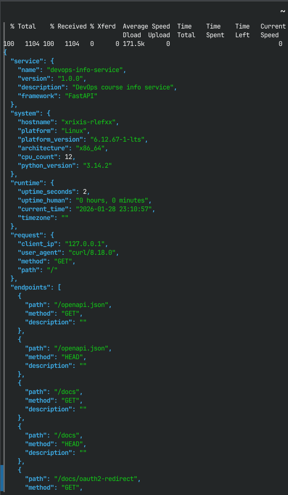
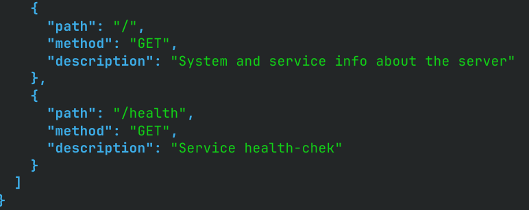
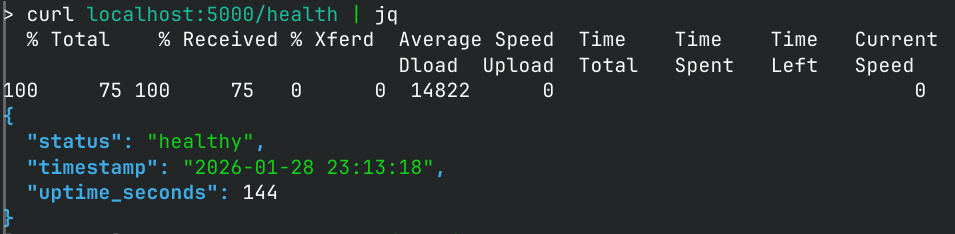
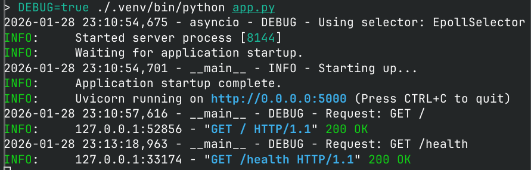

# Lab 01 — DevOps Info Service Implementation
## 1. Framework Selection

For this lab, I chose **FastAPI** as the web framework.

**Reasons:**
- Async support for high performance
- Automatic OpenAPI documentation
- Modern syntax and type hints support
- Easy integration with Python 3.11+

**Comparison with alternatives:**

| Framework | Pros                                                                                   | Cons                                                           |
|-----------|----------------------------------------------------------------------------------------|----------------------------------------------------------------|
| Flask | Lightweight, simple to learn                                                           | Synchronous by default, no auto docs                           |
| FastAPI | Async, auto-docs, type safety. Faster than alternatives. Easear security configuartion | Relatively new, not complete dependancy-injection solution     |
| Django | Full-featured, ORM included                                                            | Synchronous by default. Overkill for simple API. Heavier setup |

## 2. Best Practices Applied

1. **Clean Code Organization**
   - Functions are modular (`get_uptime()`, `root()`, `health()`)
   - Proper imports grouped by standard library, third-party, local
   - Docstrings added for clarity
   - PEP 8 style followed

2. **Logging**
    ```python
    logging.basicConfig(
        level=logging.DEBUG if DEBUG else logging.INFO,
        format='%(asctime)s - %(name)s - %(levelname)s - %(message)s'
    )
    logger.debug(f'Request: {request.method} {request.url.path}')
    ```
   * Captures requests and application start/shutdown
3. **Error Handling**
  ```python
  @app.exception_handler(HTTPException)
  async def http_exception_handler(request: Request, exc: HTTPException)-> HTMLResponse:
      """Default page for error display"""
      logger.debug(f"Error occurs {exc.detail}. Answer with code {exc.status_code}")
      return HTMLResponse(
          content=f"<h1>Error {exc.status_code}</h1><p>{exc.detail}</p>",
          status_code=exc.status_code
      )
  ```
  * FastAPI handles HTTPException natively; custom error handling can be added for 404/500
4. **Configuration via Environment Variables**
  ```python
  HOST = os.getenv('HOST', '0.0.0.0')
  PORT = int(os.getenv('PORT', 5000))
  DEBUG = os.getenv('DEBUG', 'False').lower() == 'true'
  ```
  * Allows easy deployment customization

## 3. API Documentation

### GET `/`

Returns full service and system info.

**Example Response:**

```json
{
  "service": {
    "name": "devops-info-service",
    "version": "1.0.0",
    "description": "DevOps course info service",
    "framework": "FastAPI"
  },
  "system": {
    "hostname": "my-laptop",
    "platform": "Linux",
    "platform_version": "6.12.67-1-lts",
    "architecture": "x86_64",
    "cpu_count": 12,
    "python_version": "3.13.1"
  },
  "runtime": {
    "uptime_seconds": 3600,
    "uptime_human": "1 hour, 0 minutes",
    "current_time": "2026-01-07 14:30:00",
    "timezone": "UTC"
  },
  "request": {
    "client_ip": "127.0.0.1",
    "user_agent": "curl/7.81.0",
    "method": "GET",
    "path": "/"
  },
  "endpoints": [
    {"path": "/", "method": "GET", "description": "Service information"},
    {"path": "/health", "method": "GET", "description": "Health check"}
  ]
}
```

**Testing Commands:**

```bash
curl http://127.0.0.1:5000/
```

### GET `/health`

Simple health check endpoint.

**Example Response:**

```json
{
  "status": "healthy",
  "timestamp": "2026-01-07 14:30:00",
  "uptime_seconds": 3600
}
```

**Testing Command:**

```bash
curl http://127.0.0.1:5000/health
```

## 4. Testing Evidence
### Screenshots
1. Root endpoint
    
    
2. Health-check
    
### Terminal output
```
2026-01-28 23:10:54,675 - asyncio - DEBUG - Using selector: EpollSelector
INFO:     Started server process [8144]
INFO:     Waiting for application startup.
2026-01-28 23:10:54,701 - __main__ - INFO - Starting up...
INFO:     Application startup complete.
INFO:     Uvicorn running on http://0.0.0.0:5000 (Press CTRL+C to quit)
2026-01-28 23:10:57,616 - __main__ - DEBUG - Request: GET /
INFO:     127.0.0.1:52856 - "GET / HTTP/1.1" 200 OK
2026-01-28 23:13:18,963 - __main__ - DEBUG - Request: GET /health
INFO:     127.0.0.1:33174 - "GET /health HTTP/1.1" 200 OK
```

## 5. Challenges & Solutions

* **Challenge:** Correctly capturing client IP and user-agent in FastAPI
  **Solution:** Used `request.client.host` and `request.headers.get('user-agent')`

* **Challenge:** Uptime calculation with human-readable format
  **Solution:** Created `get_uptime()` utility returning both seconds and formatted string

* **Challenge:** Logging requests without blocking main process
  **Solution:** Configured async logging and used `logger.debug()` inside endpoints

## 6. GitHub Community

* **Starred course and simple-container-com/api repositories** to support open-source visibility and bookmark useful tools.
* **Followed professor and TAs** to stay updated on course content and contributions.
* **Followed classmates** to facilitate collaboration and track peer progress.

---

