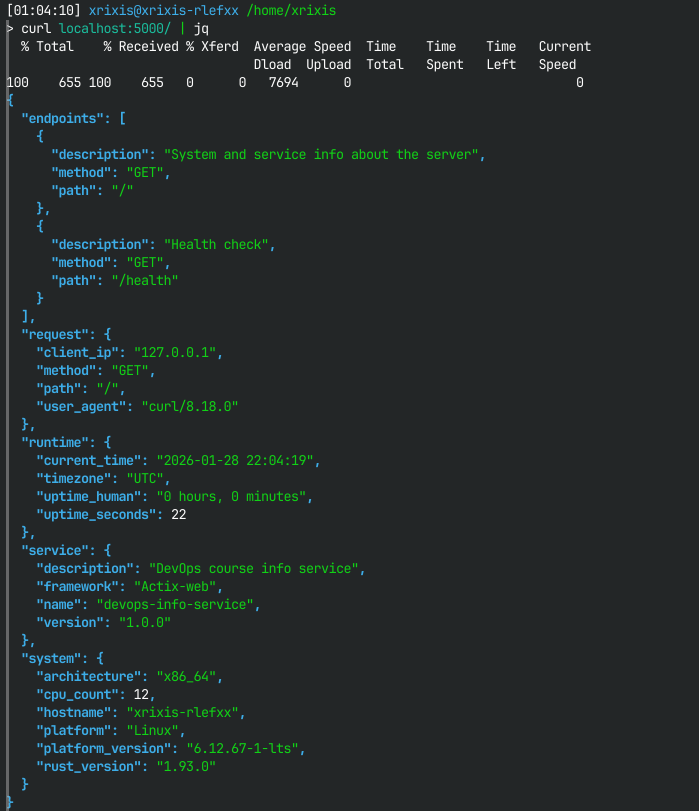
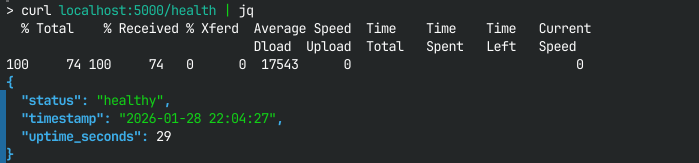

# Lab 01 - DevOps Info Service Implementation (Rust)

## 1. Best Practices Applied

### 1. Clean Code Organization

* Source code is separated into logical modules:
    * `system.rs` - system and runtime information
    * `routes.rs` - HTTP endpoint handlers
    * `main.rs` - application startup and configuration
    * `config.rs` - environment variable config
* Clear separation of responsibilities
* Idiomatic Rust formatting and naming conventions

### 2. Logging
   ```rust
   env_logger::Builder::from_default_env()
   .filter_level(if cfg.debug { LevelFilter::Debug } else { LevelFilter::Info })
   .init();
   ```

* Logging is configurable via environment variables
* Startup and incoming requests are logged
* Logging does not block request handling

[//]: # ()
[//]: # (### 3. Error Handling &#40;Not Implemented&#41;)

[//]: # ()
[//]: # (* Custom error handling is **not implemented** in this lab)

[//]: # (* Actix-web default error responses are used)

[//]: # (* Unified error pages and structured error responses are planned for a future iteration)

### 3. Configuration via Environment Variables

   ```rust
   let host = env::var("HOST").unwrap_or_else(|_| "0.0.0.0".to_string());
   let port = env::var("PORT").unwrap_or_else(|_| "5000".to_string());
   ```

* Enables flexible configuration without code changes
* Aligns with containerized and cloud deployment practices

---

## 2. API Documentation

### GET `/`

Returns service, system, runtime, and request information.

**Example Response:**

   ```json
   {
     "service": {
       "name": "devops-info-service",
       "version": "1.0.0",
       "description": "DevOps course info service",
       "framework": "Actix-web"
     },
     "system": {
       "hostname": "my-laptop",
       "platform": "Linux",
       "platform_version": "6.12.67-1-lts",
       "architecture": "x86_64",
       "cpu_count": 12,
       "rust_version": "1.75.0"
     },
     "runtime": {
       "uptime_seconds": 3600,
       "uptime_human": "1 hours, 0 minutes",
       "current_time": "2026-01-07 14:30:00",
       "timezone": "UTC"
     },
     "request": {
       "client_ip": "127.0.0.1",
       "user_agent": "curl/7.81.0",
       "method": "GET",
       "path": "/"
     },
     "endpoints": [
       { "path": "/", "method": "GET", "description": "Service information" },
       { "path": "/health", "method": "GET", "description": "Health check" }
     ]
   }
   ```

**Testing Command:**

```bash
curl http://127.0.0.1:5000/
```

---

### GET `/health`

Returns service health information.

**Example Response:**

```json
{
  "status": "healthy",
  "timestamp": "2026-01-07 14:30:00",
  "uptime_seconds": 3600
}
```

**Testing Command:**

```bash
curl http://127.0.0.1:5000/health
```

---

## 3. Testing Evidence

### Screenshots

1. Root endpoint
   

2. Health check
   

### Terminal Output

```
[2026-01-28T23:14:11Z INFO  devops_info_service] Starting DevOps Info Service on 0.0.0.0:5000 at 2026-01-28 23:14:11.577711618 UTC
[2026-01-28T23:14:11Z INFO  actix_server::builder] starting 12 workers
[2026-01-28T23:14:11Z INFO  actix_server::server] Actix runtime found; starting in Actix runtime
[2026-01-28T23:14:11Z INFO  actix_server::server] starting service: "actix-web-service-0.0.0.0:5000", workers: 12, listening on: 0.0.0.0:5000
[2026-01-28T23:14:18Z DEBUG devops_info_service::routes] Request: GET /
[2026-01-28T23:14:19Z INFO  actix_web::middleware::logger] 127.0.0.1 "GET / HTTP/1.1" 200 654 "-" "curl/8.18.0" 0.184297
[2026-01-28T23:14:26Z DEBUG devops_info_service::routes] Health check request
[2026-01-28T23:14:26Z INFO  actix_web::middleware::logger] 127.0.0.1 "GET /health HTTP/1.1" 200 74 "-" "curl/8.18.0" 0.000621
```
---

## 5. Challenges & Solutions

* **Challenge:** Correct uptime calculation
  **Solution:** Stored application start time and calculated elapsed duration dynamically.

* **Challenge:** Obtaining Rust compiler version instead of package version
  **Solution:** Used the `rustc_version` crate to retrieve the compiler version.

* **Challenge:** Lack of automatic endpoint registry
  **Solution:** Endpoint metadata is currently hardcoded.

---

## 6. GitHub Community

* Starred course-related and Rust ecosystem repositories
* Followed instructor and classmates to support collaboration
* Reviewed open-source Rust services to understand common architectural patterns

---

### ✅ Notes for Future Work

* Implement unified HTML/JSON error pages
* Add structured error types
* Introduce OpenAPI documentation generation

---
