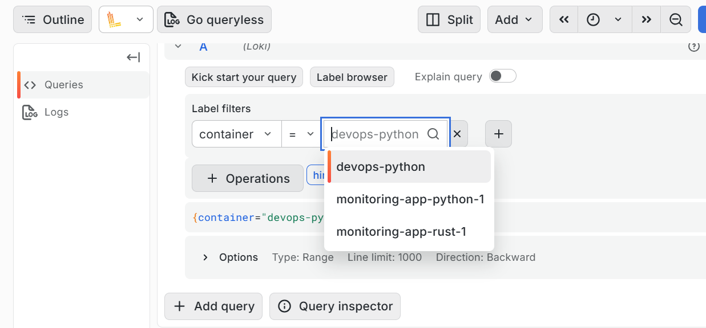
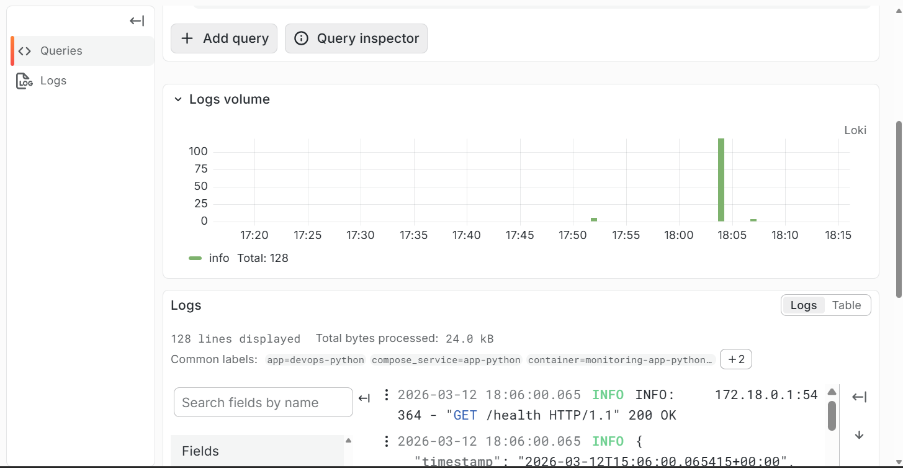
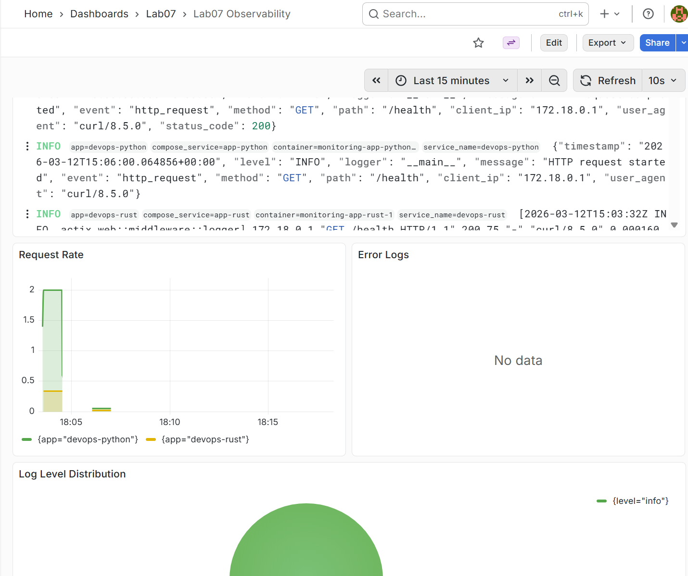
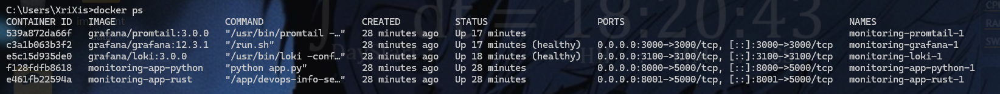
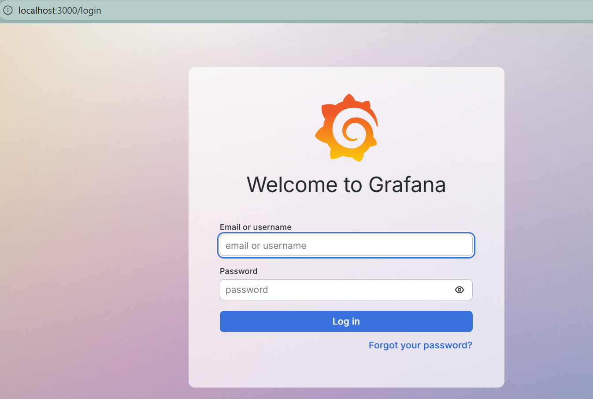

# LAB07 - Observability & Logging with Loki Stack

## 1. Architecture

```text
app-python ----\
                \
app-rust -------> Docker stdout/stderr -> Promtail -> Loki -> Grafana
                /
docker daemon --/
```

- `app-python` writes structured JSON logs to stdout.
- `app-rust` writes regular container logs to stdout.
- `Promtail` discovers only containers with label `logging=promtail`.
- `Loki` stores logs on local filesystem with TSDB schema `v13`.
- `Grafana` gets Loki via provisioned datasource and loads the dashboard from JSON.

## 2. Project Structure

```text
solution/monitoring/
  docker-compose.yml
  .env.example
  loki/config.yml
  promtail/config.yml
  grafana/provisioning/datasources/loki.yml
  grafana/provisioning/dashboards/dashboard-provider.yml
  grafana/dashboards/lab07-observability.json
  docs/LAB07.md
```

## 3. Setup Guide

1. Copy the environment file:

```bash
cd solution/monitoring
cp .env.example .env
```

2. Set a real Grafana admin password in `.env`.

3. Build and start the stack:

```bash
docker compose up -d --build
docker compose ps
```

4. Generate traffic:

```bash
for i in $(seq 1 20); do curl http://localhost:8000/; done
for i in $(seq 1 20); do curl http://localhost:8000/health; done
for i in $(seq 1 10); do curl http://localhost:8001/; done
for i in $(seq 1 10); do curl http://localhost:8001/health; done
```

5. Open Grafana at `http://localhost:3000` and log in with `.env` credentials.

## 4. Configuration

### Loki

- `schema_config` uses `store: tsdb` and `schema: v13`.
- `filesystem` is used as the object store for a single-node setup.
- `limits_config.retention_period: 168h` keeps logs for 7 days.
- `compactor.retention_enabled: true` removes expired log data.

Example snippet:

```yaml
schema_config:
  configs:
    - from: 2024-01-01
      store: tsdb
      object_store: filesystem
      schema: v13
```

### Promtail

- Docker service discovery reads metadata from `/var/run/docker.sock`.
- Container label filter keeps only services with `logging=promtail`.
- Relabeling copies the `app` label to Loki streams.
- `docker` pipeline stage unwraps Docker log envelopes.

Example snippet:

```yaml
filters:
  - name: label
    values:
      - logging=promtail
```

## 5. Application Logging

Structured logging is implemented in `solution/app_python/app.py` as:

- custom `JSONFormatter`
- request middleware
- startup/shutdown event logs
- request context fields: `method`, `path`, `status_code`, `client_ip`, `user_agent`

JSON example:

```json
{
  "timestamp": "2026-03-12T10:00:00+00:00",
  "level": "INFO",
  "logger": "app",
  "message": "HTTP request completed",
  "method": "GET",
  "path": "/health",
  "status_code": 200,
  "client_ip": "127.0.0.1"
}
```

## 6. Dashboard

Provisioned dashboard: `Lab07 Observability`.

Panels:

1. `Logs Table` -> `{app=~"devops-.*"}`
2. `Request Rate` -> `sum by (app) (rate({app=~"devops-.*"}[1m]))`
3. `Error Logs` -> `{app=~"devops-.*"} | json | level="ERROR"`
4. `Log Level Distribution` -> `sum by (level) (count_over_time({app=~"devops-.*"} | json [5m]))`

Additional Explore queries:

```logql
{app="devops-python"}
{app="devops-python"} |= "ERROR"
{app="devops-python"} | json | method="GET"
```

## 7. Production Config

- Anonymous Grafana access is disabled.
- Admin credentials are moved to `.env`.
- Resource limits and reservations are set for every service.
- Loki and Grafana include health checks.
- Persistent volumes are used for Loki and Grafana data.

## 8. Testing

Application/API checks:

```bash
curl http://localhost:3100/ready
curl http://localhost:3000/api/health
curl http://localhost:8000/health
curl http://localhost:8001/health
docker compose ps
docker compose logs app-python --tail=20
```

## 9. Challenges

- Docker log scraping through `/var/lib/docker/containers` and `/var/run/docker.sock` is Linux-host oriented. On Windows/macOS, this stack is best run on a Linux VM.
- Only the Python app emits JSON logs, so LogQL expressions with `| json` are intended mainly for `devops-python`.
- Grafana datasource and dashboard are provisioned automatically to reduce manual setup and make the stack repeatable.

## 10. Evidence

The following evidence artifacts were prepared during validation:

| Requirement | Evidence |
|---|---|
| Grafana Explore with logs from at least 3 containers |  |
| JSON log output from `app-python` |  |
| Grafana Explore with logs from `app-python` and `app-rust` |  |
| Dashboard with all 4 required panels populated |  |
| `docker compose ps` with healthy `loki` and `grafana` |  |
| Grafana login page with anonymous access disabled |  |
