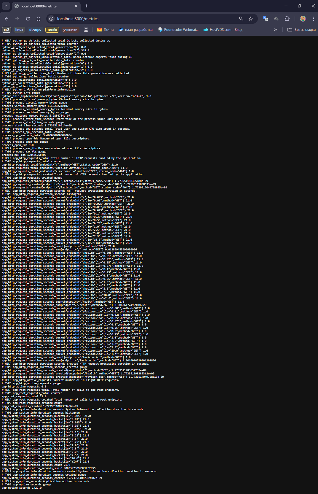
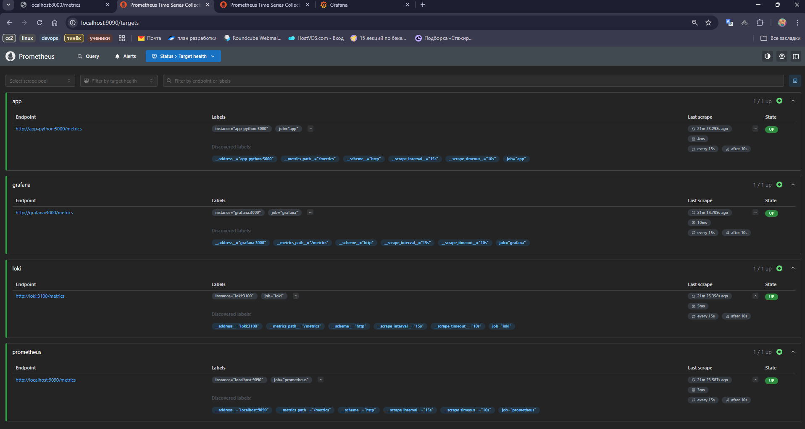
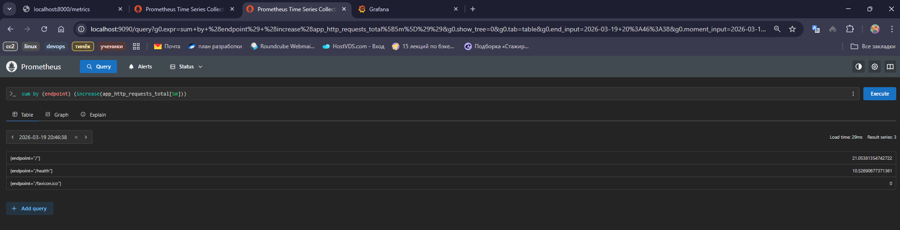
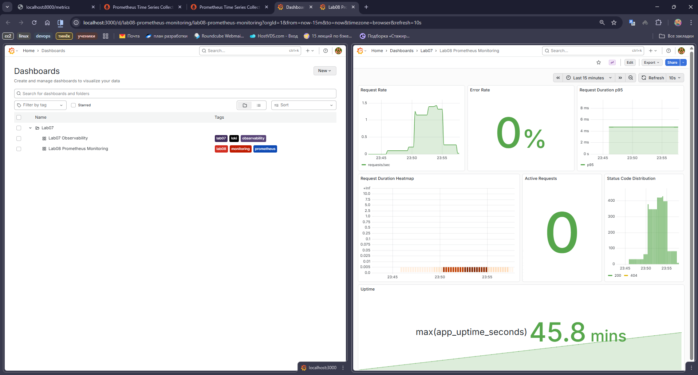
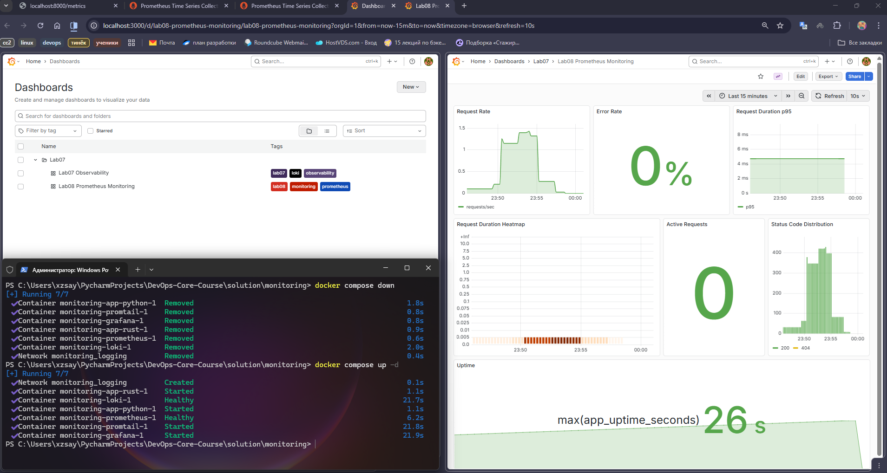

# LAB08 - Metrics & Monitoring with Prometheus

## 1. Overview
This lab extends the monitoring stack from Lab 7 by adding Prometheus-based metrics collection and Grafana-based visualization for the Python FastAPI service. The application exposes a Prometheus `/metrics` endpoint, Prometheus scrapes the application and monitoring components, and Grafana visualizes the collected time series.

Architecture flow:

```text
app-python -> Prometheus -> Grafana
app-python -> Promtail -> Loki -> Grafana
```

## 2. Implemented Monitoring
The Python application was instrumented with HTTP and service-specific metrics.

HTTP metrics:

- `app_http_requests_total`
- `app_http_request_duration_seconds`
- `app_http_active_requests`

Service-specific metrics:

- `app_root_requests_total`
- `app_system_info_duration_seconds`
- `app_uptime_seconds`

Labels used:

- request counter: `method`, `endpoint`, `status_code`
- request duration histogram: `method`, `endpoint`

Prometheus is configured with:

- scrape interval: `15s`
- evaluation interval: `15s`
- retention: `15d`
- retention size: `10GB`

Configured scrape targets:

- `prometheus:9090`
- `app-python:5000/metrics`
- `loki:3100/metrics`
- `grafana:3000/metrics`

The Grafana dashboard includes the following panels:

- Request Rate
- Error Rate
- Request Duration p95
- Request Duration Heatmap
- Active Requests
- Status Code Distribution
- Uptime

## 3. Production-Oriented Configuration
The monitoring stack includes operational settings required for stable runtime behavior.

- health checks are configured for `app-python`, `prometheus`, `loki`, and `grafana`
- resource limits are configured for Prometheus, Loki, Grafana, and both applications
- persistent volumes are configured for Prometheus, Loki, and Grafana

Resource limits:

- Prometheus: `1G`, `1.0 CPU`
- Loki: `1G`, `1.0 CPU`
- Grafana: `512M`, `0.5 CPU`
- Applications: `256M`, `0.5 CPU`

Important networking note:

- inside Docker the application target is `app-python:5000`, not `localhost:8000`

## 4. Evidence
### 4.1 Metrics Endpoint
The application exposes Prometheus metrics in text format on `http://localhost:8000/metrics`.



### 4.2 Prometheus Targets
Prometheus successfully discovers and scrapes the configured monitoring targets.



### 4.3 PromQL Query Result
The metrics can be queried directly in Prometheus. The following screenshot shows a successful query result for the application request metric.



### 4.4 Grafana Dashboard
Grafana visualizes the collected metrics through the provisioned Lab 8 dashboard.



### 4.5 Persistence Verification
The dashboard remained available after restarting the stack, which confirms that Grafana data persistence is working with the configured volume.



## 5. Validation Results
Example PromQL queries used during validation:

- `sum(rate(app_http_requests_total[5m]))`
- `sum(rate(app_http_requests_total{status_code=~"4..|5.."}[5m]))`
- `histogram_quantile(0.95, sum by (le) (rate(app_http_request_duration_seconds_bucket[5m])))`
- `sum by (status_code) (increase(app_http_requests_total[5m]))`
- `sum by (endpoint) (increase(app_http_requests_total[5m]))`
- `max(app_uptime_seconds)`

Container status collected during verification:

```text
> docker compose ps
NAME                      IMAGE                    COMMAND                  SERVICE      CREATED         STATUS                        PORTS
monitoring-app-python-1   monitoring-app-python    "python app.py"          app-python   2 minutes ago   Up 2 minutes (unhealthy)      0.0.0.0:8000->5000/tcp, [::]:8000->5000/tcp
monitoring-app-rust-1     monitoring-app-rust      "/app/devops-info-se..."   app-rust     2 minutes ago   Up 2 minutes                  0.0.0.0:8001->5000/tcp, [::]:8001->5000/tcp
monitoring-grafana-1      grafana/grafana:12.3.1   "/run.sh"                grafana      2 minutes ago   Up About a minute (healthy)   0.0.0.0:3000->3000/tcp, [::]:3000->3000/tcp
monitoring-loki-1         grafana/loki:3.0.0       "/usr/bin/loki -conf..."   loki         2 minutes ago   Up 2 minutes (healthy)        0.0.0.0:3100->3100/tcp, [::]:3100->3100/tcp
monitoring-prometheus-1   prom/prometheus:v3.9.0   "/bin/prometheus --c..."   prometheus   2 minutes ago   Up 2 minutes (healthy)        0.0.0.0:9090->9090/tcp, [::]:9090->9090/tcp
monitoring-promtail-1     grafana/promtail:3.0.0   "/usr/bin/promtail -..."   promtail     2 minutes ago   Up About a minute
```

## 6. Conclusion
The lab objective was completed by adding Prometheus instrumentation to the FastAPI service, configuring Prometheus scraping, provisioning Grafana with a Prometheus datasource, and creating a dashboard for request rate, errors, latency, active requests, status code distribution, and uptime. Together with the logging pipeline from Lab 7, this setup provides both metrics-based and log-based observability for the service.
